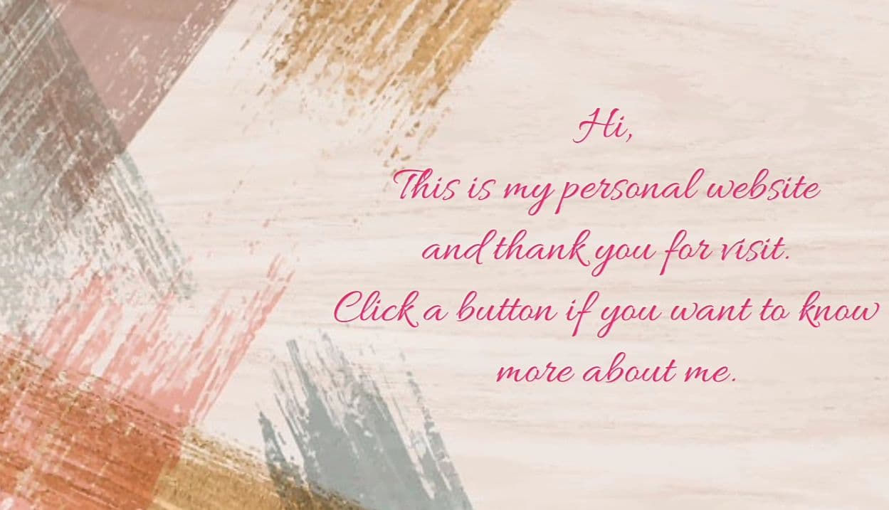

<html>

<head>
</head>
<title>Welcome to My Website</title>
<body>
<body background= "image/background/4.jpg">

 

 

<table width="1000px" align="center" border="7" cellspacing="1" cellpadding="1.5">

<tr>
<td width="1000px" align="center" bgcolor="pink"><a href="home.html" style="color: black">HOME</a></td>&nbsp;&nbsp;&nbsp;&nbsp;

<td width="1000px" align="center" bgcolor="pink"><a href="personal.html" style="color: black">PERSONAL INFORMATION</a></td>&nbsp;&nbsp;&nbsp;&nbsp;

<td width="1000px" align="center" bgcolor="pink"><a href="education.html" style="color: black">MY EDUCATION</a></td>&nbsp;&nbsp;&nbsp;&nbsp;

<td width="1000px" align="center" bgcolor="pink"><a href="family.html" style="color: black">MY FAMILY</a></td>&nbsp;&nbsp;&nbsp;&nbsp;

<td width="1000px" align="center" bgcolor="pink"><a href="friend.html" style="color: black">MY FRIEND</a></td>&nbsp;&nbsp;&nbsp;&nbsp;

<td width="1000px" align="center" bgcolor="pink"><a href="cousin.html" style="color: black">MY COUSIN</a></td>&nbsp;&nbsp;&nbsp;&nbsp;

<td width="1000px" align="center" bgcolor="pink"><a href="drama.html" style="color: black">FAVORITE DRAMA</a></td>&nbsp;&nbsp;&nbsp;&nbsp;

<td width="1000px" align="center" bgcolor="pink"><a href="song.html" style="color: black">FAVORITE SONGS</a></td>&nbsp;&nbsp;&nbsp;&nbsp;

</tr>

<footer>

COPYRIGHT &copy; AINI MUNIRAH, 2020, IMS456

</footer>

</body>
</html>
